# Budżet Studencki (szczegóły projektu znajdują się w pliku `Dokumentacja.docx` lub `Dokumentacja.pdf`)

## Wstęp

Projekt "Budżet Studencki" ma na celu umożliwienie studentom zarządzanie ich finansami w prosty i przejrzysty sposób. Aplikacja pozwala na rejestrowanie dochodów i wydatków, tworzenie kategorii dla transakcji, zarządzanie oszczędnościami oraz generowanie raportów z aktualnym bilansem. Głównymi użytkownikami są studenci, którzy mogą wprowadzać swoje dane finansowe oraz administratorzy, którzy zarządzają całością aplikacji, w tym użytkownikami i kategoriami transakcji.

## Narzędzia i technologie

Wykorzystane technologie:
- **PHP 8.3**: Skryptowy język programowania wykorzystywany na serwerze.
- **Laravel 11.x**: Framework PHP wspierający wzorzec MVC i zapewniający szereg narzędzi i bibliotek do szybkiego tworzenia aplikacji webowych.
- **MySQL**: Relacyjna baza danych używana do przechowywania danych aplikacji.
- **Tailwind CSS**: Narzędzie do szybkiego tworzenia stylów CSS z predefiniowanymi klasami.
- **Composer**: Menedżer pakietów dla PHP używany do zarządzania zależnościami.

## Baza danych

### Schemat ERD

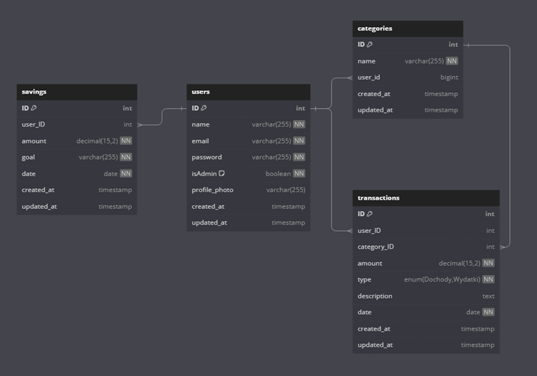

### Opis zawartości bazy danych

#### Tabela `users`
Przechowuje informacje o użytkownikach, w tym ich dane logowania i role.
- **id**: integer, primary key, auto-increment
- **name**: string
- **email**: string, unique
- **password**: string (zaszyfrowane hasło)
- **isAdmin**: boolean (flaga oznaczająca, czy użytkownik jest administratorem)
- **profile_photo**: string, nullable (ścieżka do zdjęcia profilowego)
- **created_at**: timestamp
- **updated_at**: timestamp

#### Tabela `categories`
Przechowuje kategorie transakcji tworzone przez użytkowników.
- **id**: integer, primary key, auto-increment
- **name**: string
- **user_id**: integer, foreign key (powiązanie z użytkownikiem)
- **created_at**: timestamp
- **updated_at**: timestamp

#### Tabela `transactions`
Przechowuje informacje o dochodach i wydatkach użytkowników.
- **id**: integer, primary key, auto-increment
- **user_id**: integer, foreign key (powiązanie z użytkownikiem)
- **category_id**: integer, foreign key (powiązanie z kategorią)
- **amount**: decimal
- **type**: enum ('Dochody', 'Wydatki')
- **description**: text, nullable
- **date**: date
- **created_at**: timestamp
- **updated_at**: timestamp

#### Tabela `savings`
Przechowuje informacje o oszczędnościach użytkowników.
- **id**: integer, primary key, auto-increment
- **user_id**: integer, foreign key (powiązanie z użytkownikiem)
- **goal**: string (cel oszczędności)
- **amount**: decimal
- **date**: date (data do której użytkownik chce osiągnąć cel)
- **created_at**: timestamp
- **updated_at**: timestamp

### Powiązania między tabelami

- `users` ↔ `categories`: Każdy użytkownik może mieć wiele kategorii (klucz obcy `user_id` w tabeli `categories`).
- `users` ↔ `transactions`: Każdy użytkownik może mieć wiele transakcji (klucz obcy `user_id` w tabeli `transactions`).
- `users` ↔ `savings`: Każdy użytkownik może mieć wiele oszczędności (klucz obcy `user_id` w tabeli `savings`).
- `categories` ↔ `transactions`: Każda kategoria może być powiązana z wieloma transakcjami (klucz obcy `category_id` w tabeli `transactions`).

## GUI

### Widok 1: Strona powitalna (widok desktopowy i mobilny)
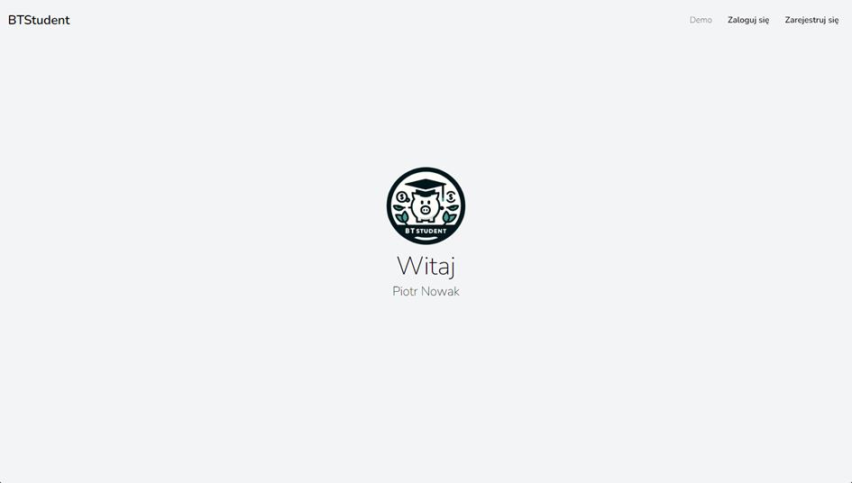
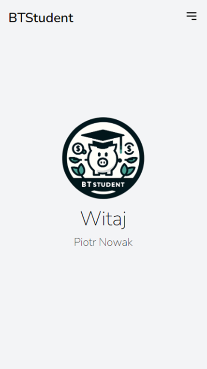

### Widok 2: Logowanie (widok desktopowy i mobilny)
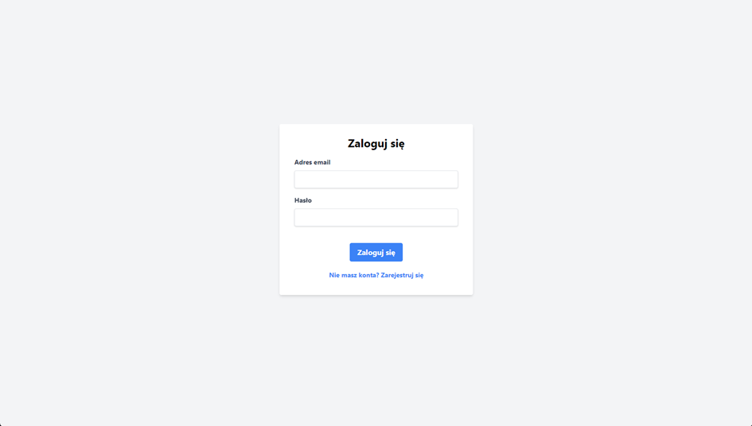
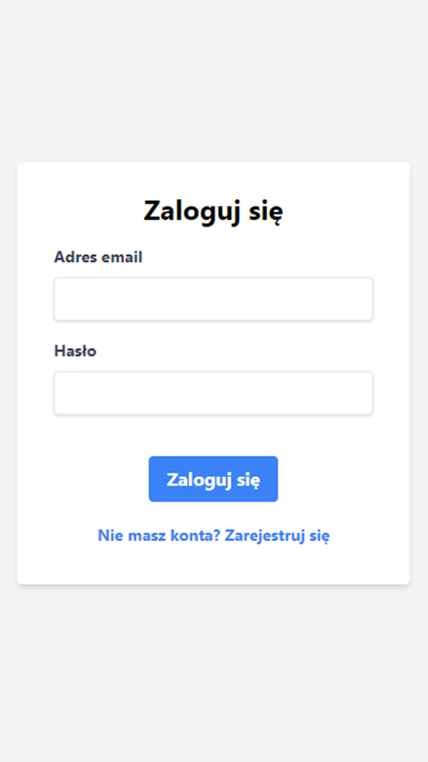

### Widok 3: Rejestracja (widok desktopowy i mobilny)
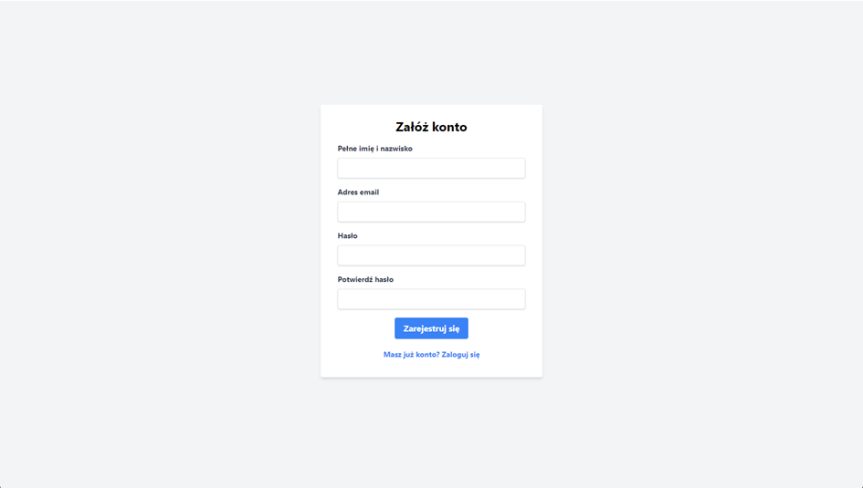
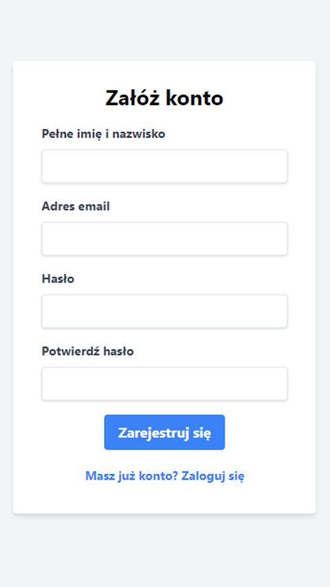

### Widok 4: Dashboard - Demo (widok desktopowy i mobilny)
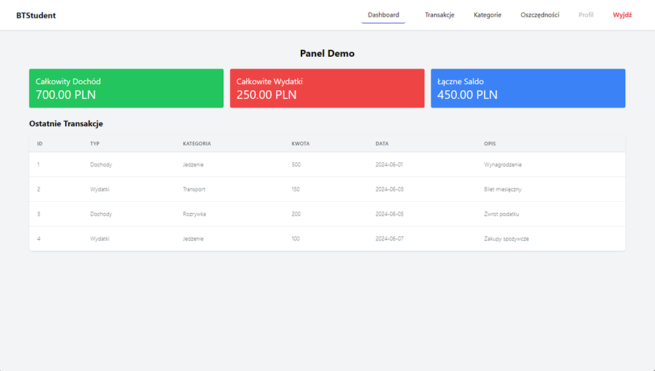
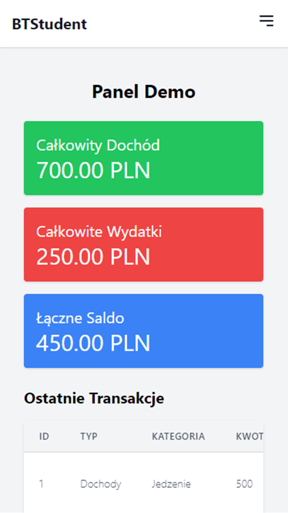

### Widok 5: Dashboard – Admin i User (widok desktopowy i mobilny)
Admin:

User:
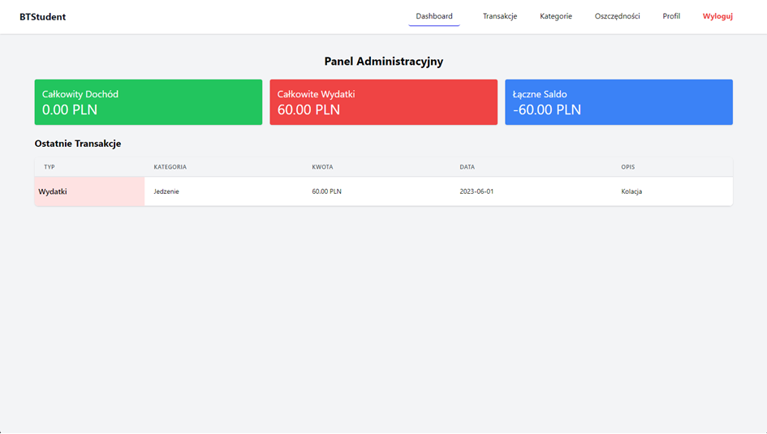
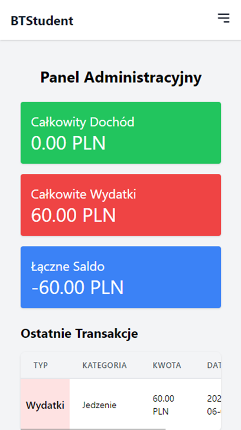

### Widok 6: Lista Transakcji – User (widok desktopowy i mobilny)
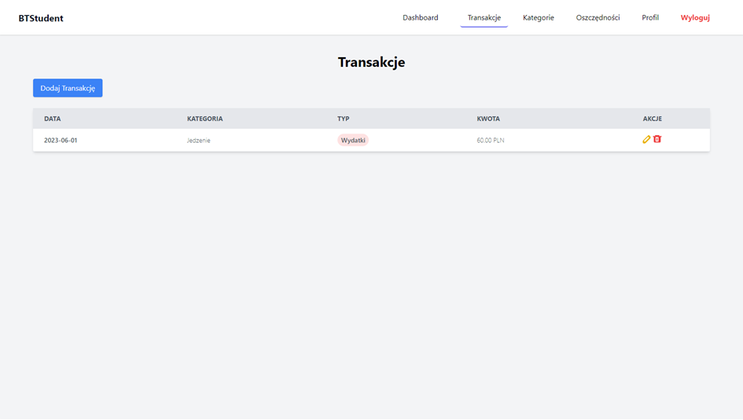
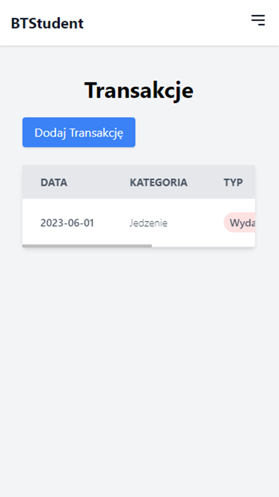

## Uruchomienie aplikacji

### Wymagania
- PHP 8.3.7
- Composer v2.7.6
- MySQL 8.4.0
- Node.js 22.0.0 (dla Tailwind CSS)
- Visual Studio Code (najnowsza wersja)
- Przeglądarka 
- XAMPP 8.2.12

### Kroki konfiguracyjne

1. Włączyć aplikację XAMPP i wystartować moduły Apache oraz MySQL.
2. W zależności od systemu operacyjnego:
    - Dla systemów Windows: kliknąć w plik `start.bat`.
    - Dla systemów Linux i Mac OS: po utworzeniu bazy migracji oraz dodaniu seederów, użytkownikowi włączy się Visual Studio Code. W lewym górnym rogu kliknąć zakładkę Terminal >> New Terminal (lub Ctrl + Shift + `).
3. Wywołać komendę `php artisan serve`.
4. Otworzyć kolejny terminal i wywołać komendę `npm run dev`.
5. Otworzyć przeglądarkę i wpisać adres: `http://127.0.0.1:8000` lub `http://localhost:8000/`.

## Funkcjonalności aplikacji

### Logowanie

#### Przykładowe konta:

- Admin: 
    - Login: admin@example.com
    - Hasło: password

- User:
    - User1
        - Login: user1@example.com
        - Hasło: password
    - User2
        - Login: user2@example.com
        - Hasło: password
    - User3
        - Login: user3@example.com
        - Hasło: password
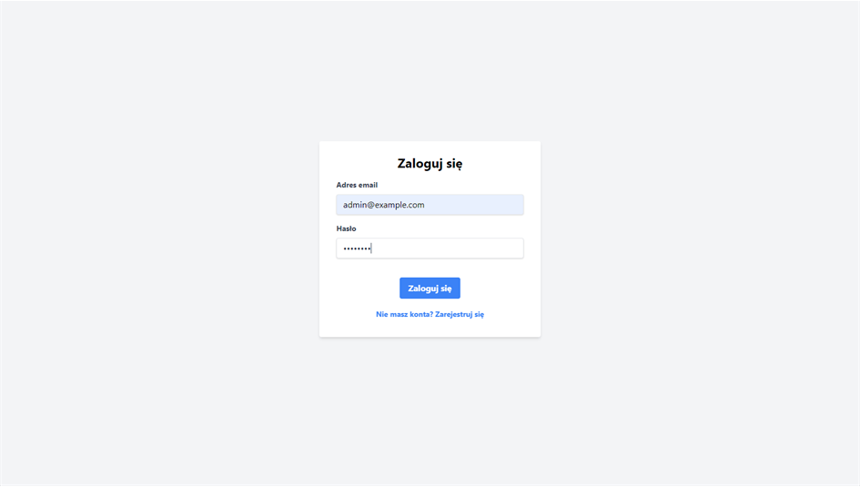
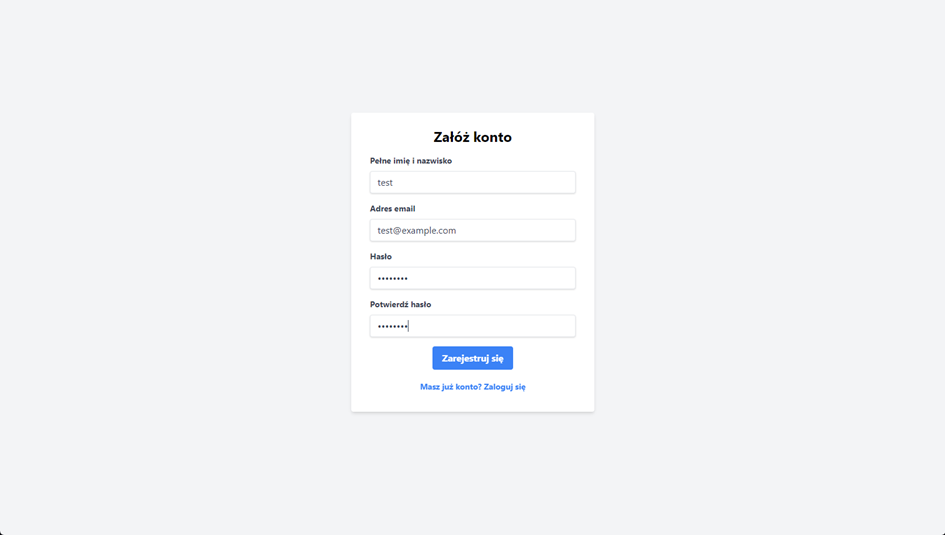

### CRUD (admin)

#### Dodawanie transakcji przez administratora
- Formularz do dodawania nowych transakcji.
- Walidacja danych na backendzie.
- Zapisanie transakcji w bazie danych.
- Przekierowanie z komunikatem o sukcesie.

#### Aktualizowanie transakcji przez administratora
- Formularz do edytowania istniejących transakcji.
- Walidacja danych na backendzie.
- Zapisanie zaktualizowanej transakcji w bazie danych.
- Przekierowanie z komunikatem o sukcesie.
